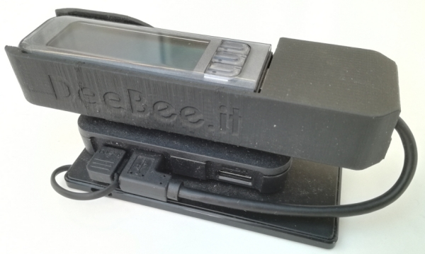

# DD-Guard (Diabetes Data Guard)

## What it is

DD-Guard provides real time blood glucose and pump data for the "*[Medtronic Minimed 670G](https://www.medtronicdiabetes.com/products/minimed-670g-insulin-pump-system)*"  insulin pump system directly to your smart phone. It intends to be simple to use and easy to setup.

The 670G pump features continuous blood glucose measurements (CGM) via the "*Guardian Link 3*" sensor and stores the data on the device. The data can be viewed on the local display. However to date Medtronic provides no means of displaying the 670Gs real time data remotely on a mobile device. And that's exactly the functionality that DD-Guard adds to the system, so care givers can watch immediately the most important data from the sensor and the pump conveniently on their smart phones, wherever they are.

DD-Guard was inspired by the [NightScout](http://www.nightscout.info) project and the #WeAreNotWaiting community which promotes DIY efforts to take advantage of the latest technology to make life easier for people with Type-1 Diabetes and their care givers.

## Project Status

My wife and I have been continuously using DD-Guard for a few months in the real world to monitor my daughters blood glucose level and pump status. On the app screen of the mobile phone we get updated data for blood glucose level (including history graph) and trend, active insulin, remaining insulin units in the pumps tank and both pump and sensor battery status (displayed alternatively). Bolus events are displayed on the graph. The displayed data is color coded according to the actual conditions so it is immediately clear if there is anything critical which needs to be acted upon. The system is robust and running for weeks without any issues. 

It is possible for my daughter to take the small gateway device with her when she is going to spend the night at a friends house, so we can still monitor her data. The gateway works as long as it has a power supply and a Wifi network connection.

The gateway software now runs reliably also on the tiny [Raspberry Pi Zero](https://www.raspberrypi.org/products/raspberry-pi-zero-w/) device which can be powered for may hours from a battery pack and therefore carried in a small backpack, making the gateway truly mobile.

A Nightscout uploader option is available for the DD-Guard gateway, so it can upload the live sensor and pump data also to a Nightscout server and replace the commonly used Android phone uploader for this system (unless you need all the bells and whistles from the latter).

## Screenshots

These are some typical screenshots from the smartphone app.

## How it works

The basic idea is to receive the real time data which was collected by the 670G with the DD-Guard gateway via the "*Contour Next Link* 2.4" glucose meter which operates as the radio bridge and then uploads the data to the cloud and a mobile device where it is eventually displayed with the DD-Guard app.

The DD-Guard gateway is a small single board computer, like the Raspberry Pi where the radio bridge is plugged into one of its USB ports. Cloud connection is established via the gateways Wifi.

## What hardware do you need

In order to use DD-Guard you need the following items:

- Medtronic Minimed 670G insulin pump (also works with 640G)
- Guardian Link blood glucose sensor and radio transmitter 
- Contour Next Link 2.4 blood glucose meter and radio bridge
- A single board computer with USB and Wifi like RaspberryPi 3 or similar as DD-Guard gateway
- A smartphone

If the person you build this system for is a T1D patient on insulin pump therapy you probably already have the first 3 items if you chose the Medtronic device. And chances are good you already have a smartphone.

So all you need to do is build your own gateway. It needs a USB port to connect to the radio bridge and Wifi to connect to the cloud.

## What software do you need

These are the logical software components which are needed to make it all work together:

- The **DD-Guard smartphone app** which receives the data from the cloud and displays it.
- The **Cloud service** which receives the data from the gateway and forwards it to the smartphone app
- The **DD-Guard gateway software** which periodically receives the data from the pump and uploads it to the cloud service

## Disclaimer

This project is not associated to or endorsed by [Medtronic](https://www.medtronicdiabetes.com). If you decide to use DD-Guard then you do this entirely at your own risk. I am not reliable for any damage it might cause. 
