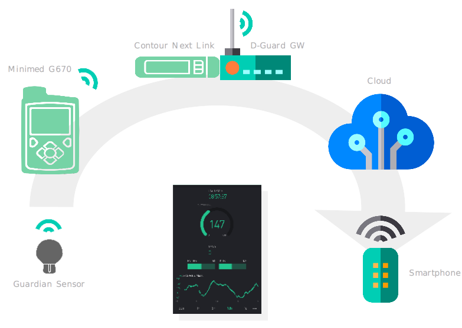

# DD-Guard (Diabetes Data Guard)

## What it is

DD-Guard is an attempt to add remote real time pump data and sensor monitoring via Smartphone app to the "*[Medtronic Minimed 670G](https://www.medtronicdiabetes.com/products/minimed-670g-insulin-pump-system)*" insulin pump system.

The 670G pump features continuous blood glucose measurements (CGM) via the "*Guardian Link 3*" sensor and stores the data on the device. The data can be viewed on the local display. However to date Medtronic provides no means of displaying the 670Gs real time data remotely on a mobile device. And that's exactly the functionality that DD-Guard adds to the system, so you can watch immediately the most important data from the sensor and the pump on your smartphone.

DD-Guard was inspired by the [NightScout](http://www.nightscout.info) project and the #WeAreNotWaiting community which promotes DIY efforts to take advantage of the latest technology to make life easier for people with Type-1 Diabetes and their care givers.

## How it works

The basic idea is to receive the real time data from the 670G with the DD-Guard gateway via the "*Contour Next Link*" glucose meter which operates as the radio receiver and then uploads the data to the cloud and a mobile device where it is displayed eventually with the DD-Guard app.

The DD-Guard gateway is a small single board computer, like the Raspberry Pi where the radio receiver is plugged into one of its USB ports. Cloud connection is established via the gateways Wifi.

## What hardware do you need

In order to use DD-Guard you need the following items:

- Medtronic Minimed 670G insulin pump
- Guardian Link blood glucose sensor and radio transmitter 
- Contour Next Link 2.4 blood glucose meter and radio transmitter
- A single board computer with USB and Wifi like RaspberryPi 3 or similar as DD-Guard gateway
- A smartphone

If the person you build this system for is a T1D patient on insulin  pump therapy you probably already have the first 3 items if you chose the Medtronic device. And chances are good you already have a smartphone.

## The Components of the system

These are the logical components which are needed to make it all work together:

- The **DD-Guard gateway software** which periodically receives the data from the pump and uploads it to the cloud service
- The **Cloud service** which receives the data from the gateway and forwards it to the smartphone app
- The **DD-Guard smartphone app** which receives the data from the cloud and displays it.

## The Gateway Software

The gateway software is some Python code which interfaces with the Contour Next Link 2.4 to receive periodically the updated pump and sensor data. When the data is received successfully it uploads it to the cloud service.

### Installation

You need Python support which is installed by default on the RaspberryPi OS "Raspbian". Additionally some non standard libraries need to added.

Install needed Python libraries:

    sudo pip install blynklib
    sudo pip install astm
    sudo pip install crc16
    sudo apt install python-hid python-hidapi
    sudo apt install python-pycryptodome
    sudo apt install python-lzo
    sudo apt install python-dateutil

Install source code:

TODO

### Start daemon

    python ddguard.py

## The Cloud service

The cloud service currently used is the publically available [Blynk server](https://github.com/blynkkk/blynk-server)

## The Smartphone app

The smartphone app for the current DD-Guard prototype is based on the [Blynk](https://blynk.io) IoT platform. It allows for incredibly quick and easy implementation of the features that are needed for DD-Guard. However, while prototyping with the platform is free, generating and publishing the final app is a paid service which is *really* expensive.

Therefore the final goal for this project must be a native open source smartphone app. Contributors who want to help with this are very welcome.

## Credits

This project is based on other peoples work which I want to thank for their efforts.

- [Lennart Goedhart](https://github.com/pazaan) who implemented the [Python driver](https://github.com/pazaan/decoding-contour-next-link) for the Contour Next Link 2.4 radio bridge to the Minimed 670G

## Disclaimer

This project is not associated to or endorsed by [Medtronic](https://www.medtronicdiabetes.com). If you want to use DD-Guard then you do this entirely at your own risk and I am not reliable for any damage it might cause. 