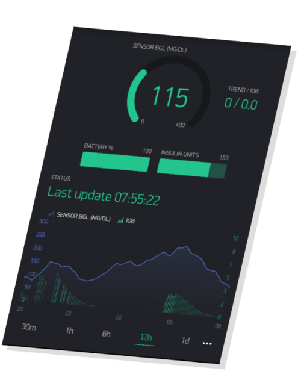
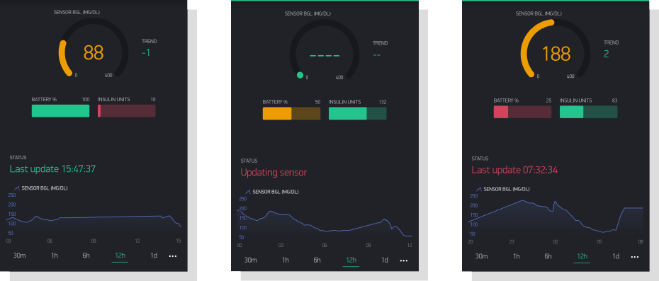
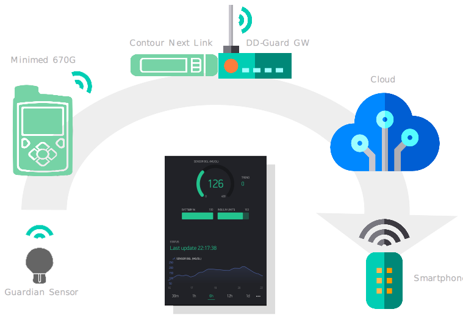
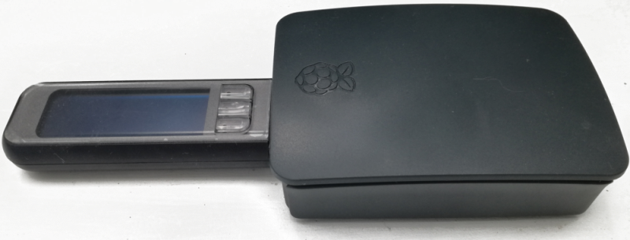

# DD-Guard (Diabetes Data Guard)

## What it is

DD-Guard provides real time blood glucose and pump data for the "*[Medtronic Minimed 670G](https://www.medtronicdiabetes.com/products/minimed-670g-insulin-pump-system)*"  insulin pump system directly to your smart phone. It intends to be simple to use and easy to setup.



The 670G pump features continuous blood glucose measurements (CGM) via the "*Guardian Link 3*" sensor and stores the data on the device. The data can be viewed on the local display. However to date Medtronic provides no means of displaying the 670Gs real time data remotely on a mobile device. And that's exactly the functionality that DD-Guard adds to the system, so care givers can watch immediately the most important data from the sensor and the pump conveniently on their smart phones, wherever they are.

DD-Guard was inspired by the [NightScout](http://www.nightscout.info) project and the #WeAreNotWaiting community which promotes DIY efforts to take advantage of the latest technology to make life easier for people with Type-1 Diabetes and their care givers.


## Project Status

Currently I have implemented a working prototype of DD-Guard which I use in the real world to monitor my daughters blood glucose level and pump status when she is near the gateway. On the app screen of my mobile phone I get updated data for blood glucose level (including history graph) and trend, active insulin, remaining insulin units in the pumps tank and both pump and sensor battery status. Bolus events are displayed on the graph. The displayed data is color coded according to the actual conditions so it is immediately clear if there is anything critical which needs to be acted upon.

It is possible for my daughter to take the small gateway device with her when she is going to spend the night at a friends house, so I can still monitor her data. The gateway works as long as it has a power supply and a Wifi network connection.

The gateway software now runs reliably on the tiny [Raspberry Pi Zero](https://www.raspberrypi.org/products/raspberry-pi-zero-w/) device which can be powered from a battery pack and therefore carried in a small backpack, making the gateway truly mobile.

A Nightscout uploader option is also available for the DD-Guard gateway, so it can upload the live sensor and pump data also to a Nightscout server and replace the commonly used phone uploader for this system.


## Screenshots

These are some typical screenshots from the smartphone app.




## How it works

The basic idea is to receive the real time data which was collected by the 670G with the DD-Guard gateway via the "*Contour Next Link* 2.4" glucose meter which operates as the radio bridge and then uploads the data to the cloud and a mobile device where it is eventually displayed with the DD-Guard app.

The DD-Guard gateway is a small single board computer, like the Raspberry Pi where the radio bridge is plugged into one of its USB ports. Cloud connection is established via the gateways Wifi.




## What hardware do you need

In order to use DD-Guard you need the following items:

- Medtronic Minimed 670G insulin pump
- Guardian Link blood glucose sensor and radio transmitter 
- Contour Next Link 2.4 blood glucose meter and radio bridge
- A single board computer with USB and Wifi like RaspberryPi 3 or similar as DD-Guard gateway
- A smartphone

If the person you build this system for is a T1D patient on insulin pump therapy you probably already have the first 3 items if you chose the Medtronic device. And chances are good you already have a smartphone.

So all you need to do is build your own gateway. It needs a USB port to connect to the radio bridge and Wifi to connect to the cloud.





## What software do you need

These are the logical software components which are needed to make it all work together:

- The **DD-Guard smartphone app** which receives the data from the cloud and displays it.
- The **Cloud service** which receives the data from the gateway and forwards it to the smartphone app
- The **DD-Guard gateway software** which periodically receives the data from the pump and uploads it to the cloud service


## Installation and configuration

### The Smartphone app

The smartphone app for the current DD-Guard prototype is based on the [Blynk](https://blynk.io) IoT platform. It allows for incredibly quick and easy implementation of the features that are needed for DD-Guard. However, while prototyping with the platform is free, generating and publishing the final app is a paid service which is *really* expensive.

*Therefore the final goal for this project must be a native open source smartphone app which we have complete control of. Contributors who want to help with this are very welcome.*

To use the Blynk based DD-Guard app you have to install the [Blynk app](http://j.mp/blynk_Android) on your smartphone and register to the service. After you have logged in you just scan the QR code below which will load the DD-Guard app project.


In the project settings you still have to add your gateway and create the access token. This should be quite straightforward but if you need help check the [Blynk documentation](https://docs.blynk.cc). Once you have created the DD-Guard app for your gateway, you can share it with family members and friends to display the data forwarded by your gateway. 

### The Gateway Software

The gateway software is a Python program which interfaces with the Contour Next Link 2.4 to receive periodically the updated pump and sensor data. When the data is received successfully it uploads it to the cloud service.

#### Installation

You need Python support which is installed by default on the RaspberryPi OS "Raspbian". Additionally some non standard libraries need to added.

##### Install needed Python libraries:

    sudo pip install blynklib
    sudo pip install astm
    sudo pip install crc16
    sudo apt install python-hid python-hidapi
    sudo apt install python-pycryptodome
    sudo apt install python-lzo
    sudo apt install python-dateutil
    sudo apt install python-requests

##### Install source code:

```
git clone https://github.com/ondrej1024/ddguard.git
cd ddguard
sudo ./install.sh
```


#### Modify configuration

Modify the configuration parameters in `/etc/ddguard.conf` to match your setup.

```
################################################
#
# ddguard configuration file
#
# This file is read by the ddguard daemon
# from /etc/ddguard.conf
#
################################################

# Blynk parameters
################################################
[blynk]
server =                 # Blynk server address, e.g. blynk-cloud.com
token =                  # my personal Blynk token
heartbeat = 20           # heartbeat period (s)
    
# Nightscout parameters
################################################
[nightscout]
server =                 # Nightscout server address. e.g my-ns-server.org
api_secret =             # my Nightscout API secret

# BGL parameters
################################################
[bgl]
bgl_low       =  80   # BGL low threshold (color data red when below)
bgl_pre_low   = 100   # BGL pre low threshold (color data yellow when below)
bgl_pre_high  = 160   # BGL pre high threshold (color data yellow when above)
bgl_high      = 220   # BGL high threshold (color data red when above)
```


#### Start daemon

    systemctl start ddguard


### The Cloud service

The cloud service currently used is the publicly available [Blynk server](https://github.com/blynkkk/blynk-server) which is already up and running. No setup or configuration is needed.

However if full control over the server is needed it can also be installed on any private host.

Alternatively, if you want to upload your data to a Nightscout server follow the installation instructions for the server provided by the Nightscout project.


## Credits

This project is based on other peoples work which I want to thank for their efforts.

- [Lennart Goedhart](https://github.com/pazaan) who implemented the excellent [Python driver](https://github.com/pazaan/decoding-contour-next-link) for the "Contour Next Link 2.4" radio bridge to the Minimed 670G
- [Pogman](https://github.com/Pogman) for putting up with my questions and providing me with the pointers to the details of the Nightscout uploader implementation.
- [oldsterIL](https://github.com/oldsterIL) for contributing valuable code to the CNL2.4 driver lib


## Disclaimer

This project is not associated to or endorsed by [Medtronic](https://www.medtronicdiabetes.com). If you decide to use DD-Guard then you do this entirely at your own risk. I am not reliable for any damage it might cause. 